# ThinkTurf MVP: Technical Design (Tutor workflows first)

Scope: Must-have items only, from the design-blocks doc. Flow: hybrid (Option C). App users in MVP: **Founder, Admin staff, Tutor**. Schools, students and guardians exist as records only, with no login.

Items marked *(proposed)* are my assumptions, not decisions from the doc.

---

## 1. Module map

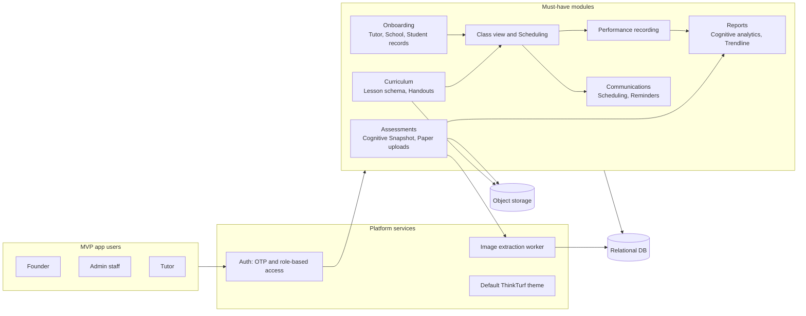

---

## 2. Data model (ER)

Key design points:

- `STUDENT` holds only a pseudonymous token. All PII lives in `STUDENT_IDENTITY`, which also carries the school's own student ID (the school ID to unique ID mapping).
- Tutors reach schools through `TUTOR_ASSIGNMENT` (many-to-many, via class).
- A six-month re-assessment is a new `CSS_ASSESSMENT` row with `cycle_no + 1`.
- The class view is a derived read model. Its only new table is `CLASS_LESSON_PLAN`, the ordered lessons planned for a class. Handout progress is computed from that plan, the class roster and `SUBMISSION` rows.

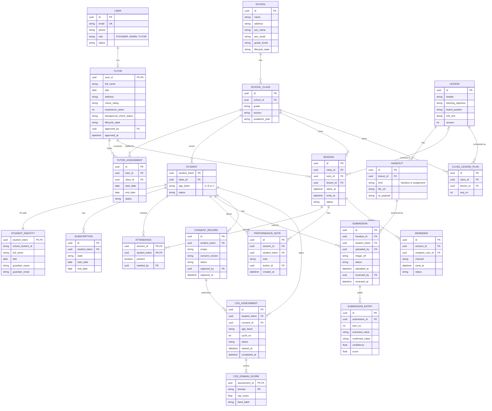

---

## 3. Lifecycle state machines

### Tutor

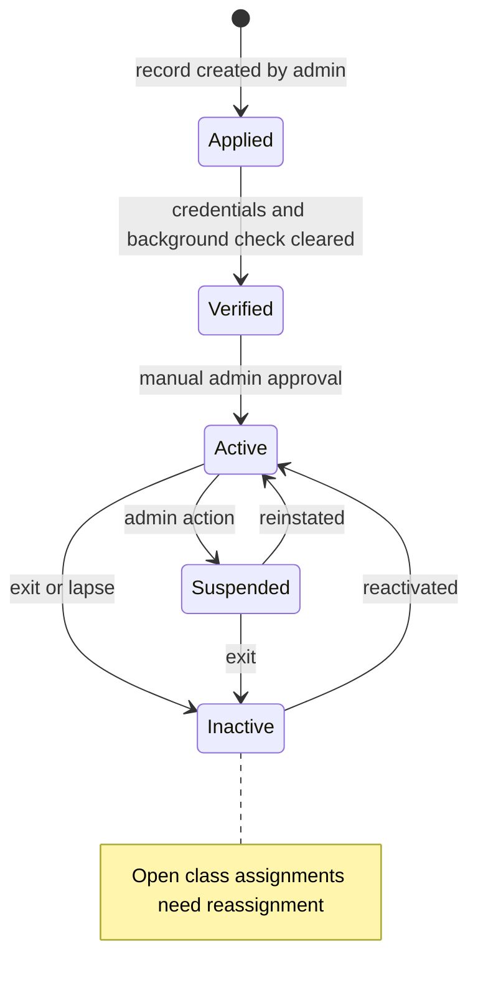

### School

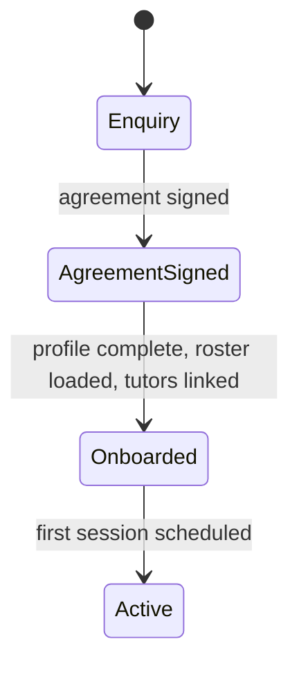

The `Onboarded` to `Active` trigger is *(proposed)*.

### Student subscription

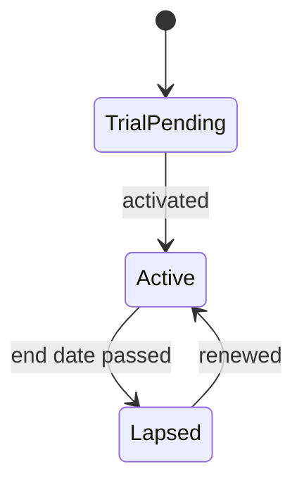

---

## 4. Sequence: tutor onboarding and approval

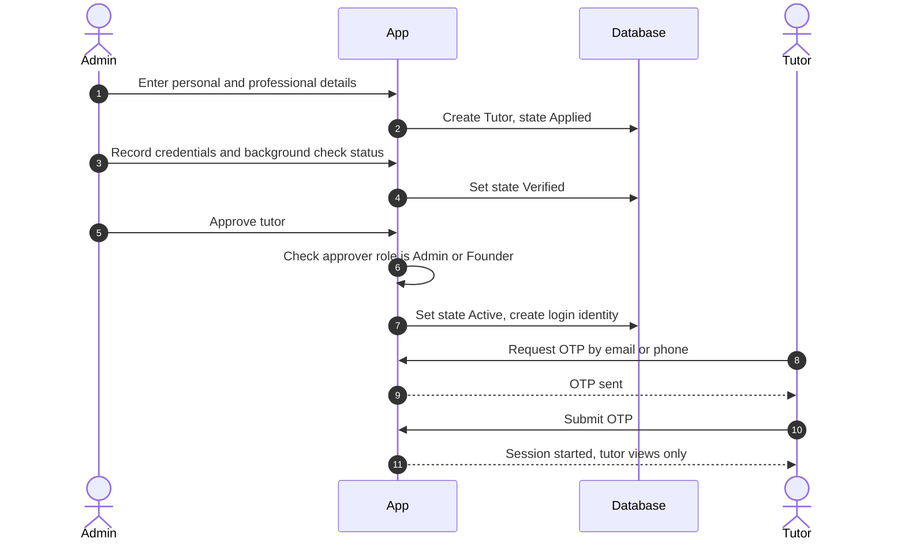

---

## 5. Sequence: session, attendance and performance note

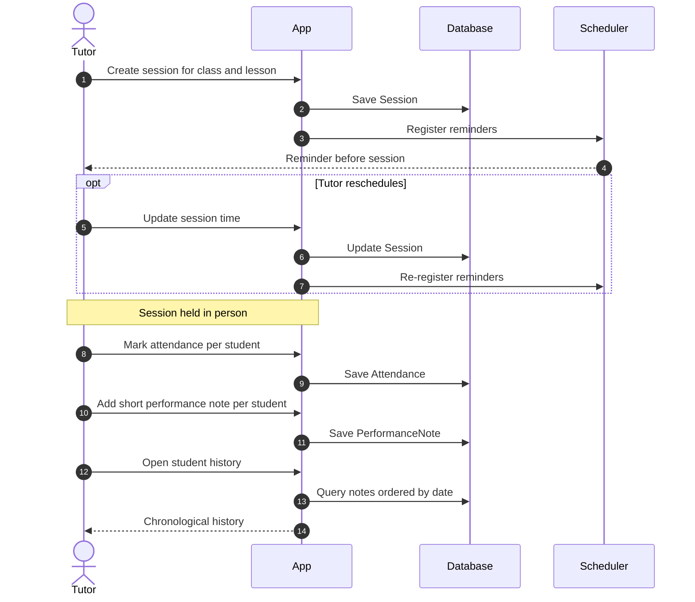

---

## 6. Class view

A tutor reaches a class from the schedule (tap a session) or by searching, limited to classes they are assigned to. The view shows strength, the roster, and handout progress.

**Definition:** a handout is done for a student when that student has submitted the assignment. For the class, a handout is Done when every enrolled student has submitted. *(Counting only Confirmed submissions is proposed; uploads still in review show as "in review".)*

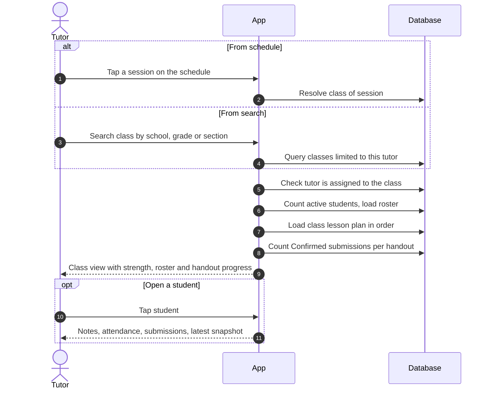

### Handout status within a class (derived, not stored)

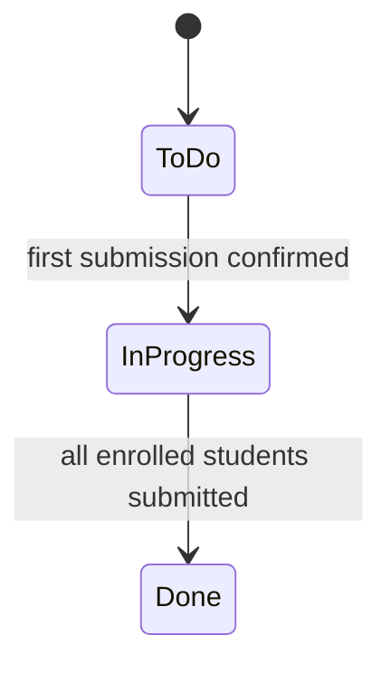

Class view layout:

- **Header:** school, grade and section, strength, assigned tutor(s), next session.
- **Roster:** each student with handouts submitted out of planned so far.
- **Handouts:** Done, In progress (for example 22 of 30 submitted), To do, in plan order.
- **Sessions:** upcoming and past.

---

## 7. Sequence: Cognitive Skill Snapshot (tutor-run)

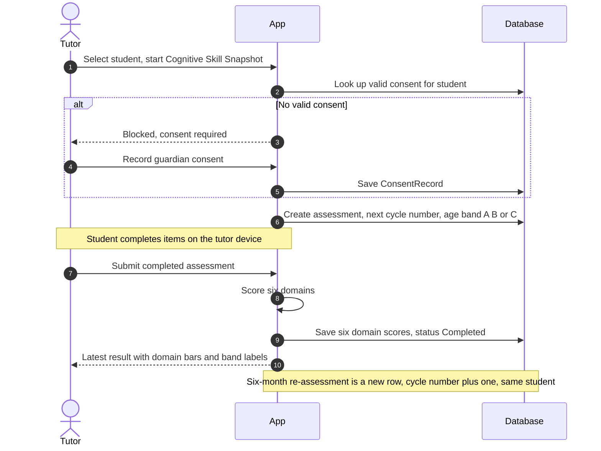

---

## 8. Sequence: paper assignment to database entries

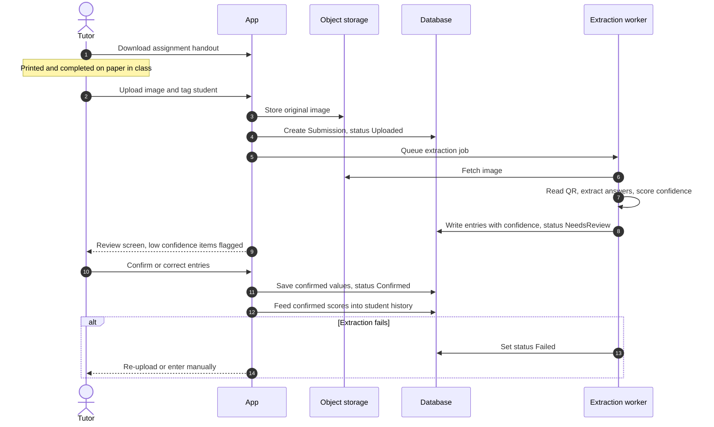

### Submission status

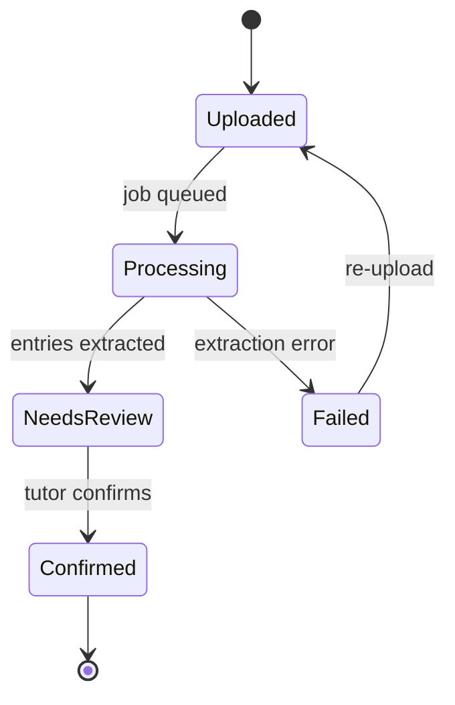

---

## 9. Role permissions *(proposed)*

| Capability | Founder | Admin | Tutor |
|---|---|---|---|
| Create and verify tutors | Yes | Yes | No |
| Approve tutor to Active | Yes | Yes | No |
| Onboard schools, load rosters, link tutors | Yes | Yes | No |
| Author lessons and handouts | Yes | Yes | No |
| Download handouts | Yes | Yes | Assigned classes |
| Create and update sessions | Yes | Yes | Own sessions |
| View class (strength, roster, handout progress) | Yes | Yes | Assigned classes |
| Set a class lesson sequence | Yes | Yes | No |
| Attendance and performance notes | View | View | Assigned classes |
| Run snapshot, upload assignments | View | View | Assigned students |
| Individual reports | Yes | Yes | Assigned students |
| Cross-school and cohort analytics | Yes | Yes | No |

---

## 10. Open decisions

1. **Approval authority:** can Admin approve a tutor to Active, or Founder only?
2. **No rejection path:** the doc's tutor lifecycle has no state for an applicant who fails verification.
3. **Consent evidence:** with no parent login, how is guardian consent captured (paper form uploaded, or collected by the school)?
4. **Extraction review:** I recommend tutor confirmation before anything is committed, since handwriting and board diagrams from children will extract with errors. Also decide how the student is identified: tutor tags at upload, or a per-student code printed on the handout.
5. **Reminders:** do they go to tutors only, given there are no parent accounts?
6. **School Active trigger:** what moves a school from Onboarded to Active?
7. **Lesson sequence owner:** I assumed Admin sets each class's sequence and tutors cannot edit it. Say if tutors should reorder.
8. **Absent students:** if one student never submits, the class can never reach Done. I recommend a per-student Waived state on a handout, set by the tutor.
9. **What counts as submitted:** I assumed Confirmed only. Counting uploads still in review would inflate progress before the tutor has checked the extraction.
10. **Mid-year roster changes:** the Done denominator should use students enrolled at the time. Late joiners need a rule for past handouts.

## 11. Deliberately deferred (Good and May have)

Self-service tutor application, bulk CSV student import, state-change notifications, parent-side views, assessment history comparison, resume of interrupted assessments, norm referencing, configurable item banks, trend charts and auto-generated digests. The schema above leaves room for these without migration: the identity split, `cycle_no`, and `HANDOUT.kind`.
