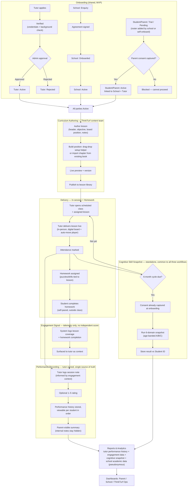

# C — Hybrid

Keeps Option A's content delivery (in-session digital board + homework) but drops the separate chess-assessment engine. Homework/lesson-completion data is surfaced to the tutor as **context only** — the tutor's note and rating remain the single source of truth for progress.

Avoids two competing 'assessment' signals (a risk in Option A), at close to Option A's build cost.

