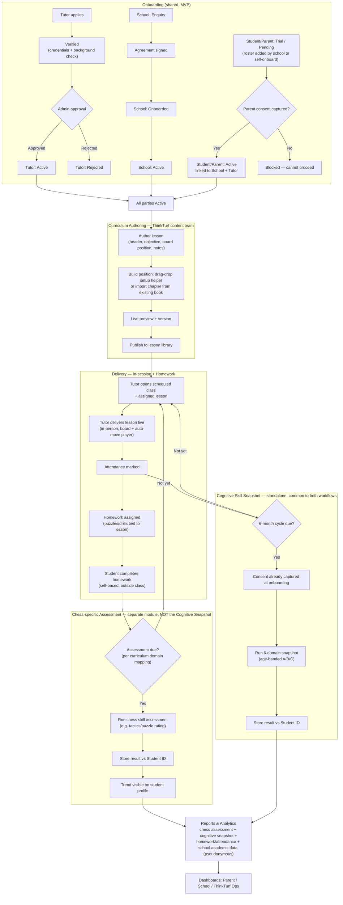

# A — Platform Tutorial + Assessment

Full digital curriculum authoring, in-session delivery, homework, **and** a separate chess-specific assessment engine, distinct from the Cognitive Skill Snapshot.

Biggest build of the three options: an authoring pipeline, delivery tooling, and an assessment engine with its own scoring/calibration.

