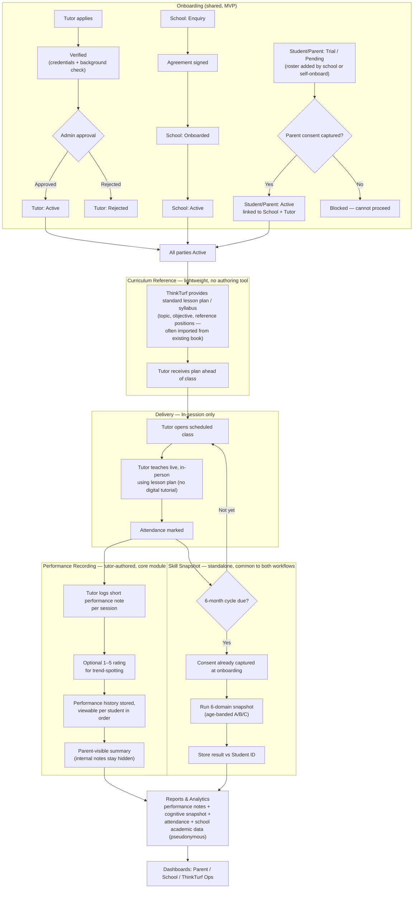

# B — Tutor-Based Feedback

No platform-hosted curriculum or homework. Tutors teach from a lightweight, centrally-issued lesson plan. Attendance plus a per-session note and optional rating is the entire progress record.

Closest to what's already spec'd in Performance Recording — smallest build.

